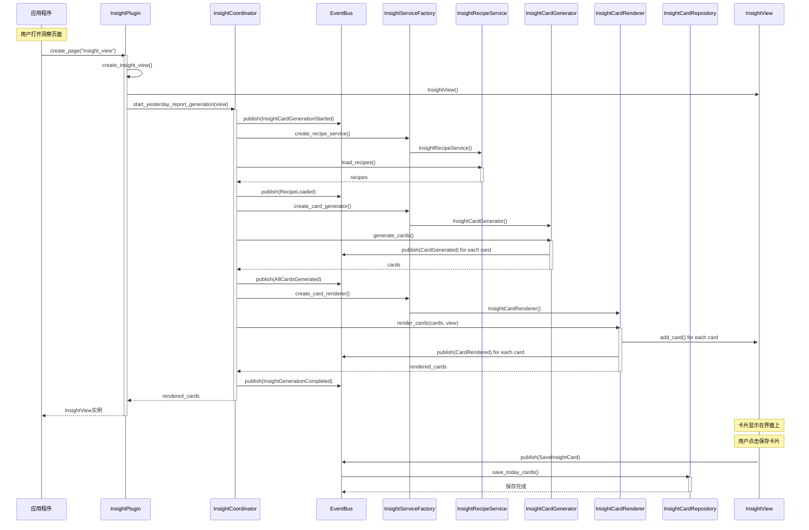

# Insight插件UML序列图

## 洞察卡片生成流程序列图

## 关键交互说明

### 1. 初始化阶段
- **应用程序** 调用 `InsightPlugin.create_page()`
- **插件** 创建视图并启动 `InsightCoordinator`

### 2. 配方加载阶段  
- **Coordinator** 通过工厂创建 `RecipeService`
- 加载并解析洞察卡片配方
- 发布 `RecipeLoaded` 事件

### 3. 卡片生成阶段
- **Coordinator** 通过工厂创建 `CardGenerator`
- 生成条件卡片和固定卡片
- 为每张卡片发布 `CardGenerated` 事件
- 发布 `AllCardsGenerated` 事件

### 4. 卡片渲染阶段
- **Coordinator** 通过工厂创建 `CardRenderer`
- 将卡片渲染到界面
- 为每张卡片发布 `CardRendered` 事件
- 发布 `InsightGenerationCompleted` 事件

### 5. 卡片保存阶段
- 用户操作触发 `SaveInsightCard` 事件
- **EventBus** 通知 `Repository` 保存卡片

## 架构特点

1. **事件驱动**: 每个关键步骤都发布相应事件
2. **接口依赖**: 通过工厂模式创建服务，依赖接口而非具体实现
3. **职责分离**: 每个组件职责单一明确
4. **可扩展性**: 新增卡片类型只需实现相应接口